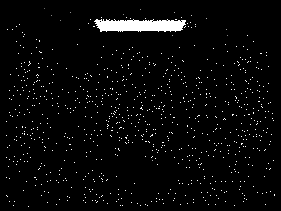
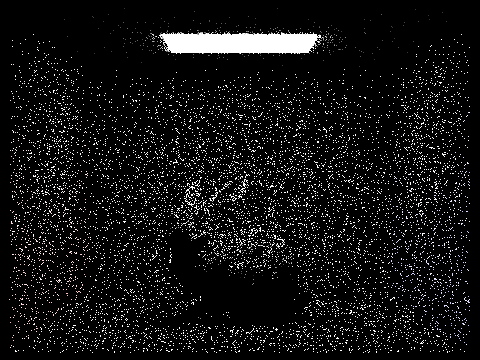
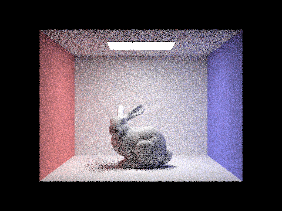
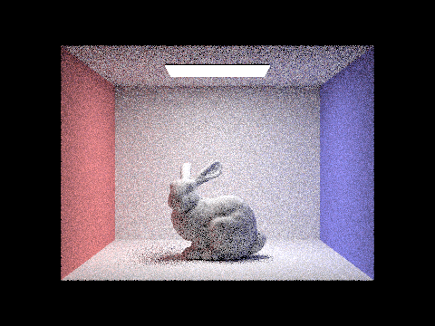
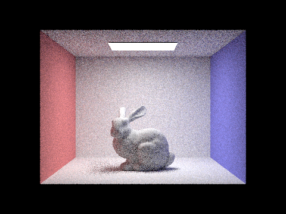
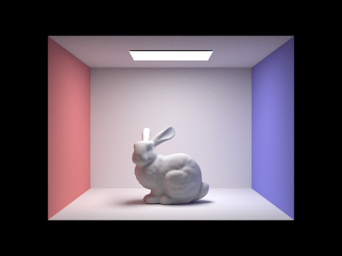
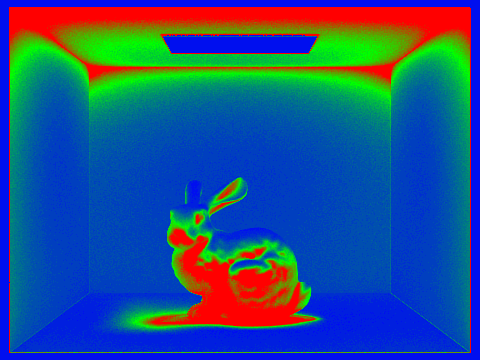

# Overview
We implemented rendering scenes with lighting! More importantly, we used several efficient algorithms (BVH, Russian Roulette for light bounces, adaptive sampling) that result in good-looking renders in a reasonable time.

# Part 1
**Ray generation**: We used the formula for the center of the virtual camera sensor $(-tan(\frac{hFov}{2}), -tan(\frac{hFov}{2}), -1)$, projected it to world space, and made sure the ray is normalized.

**Triangle intersection**: 
The triangle intersection algorithm checks if a ray intersects a triangle by calculating the triangle's edge vectors and using cross products to find vectors orthogonal to the ray direction and triangle edges. It then computes a denominator and intersection parameters (distance along the ray and Barycentric coordinates) to determine if the intersection point lies within the triangle and the ray's bounds. If an intersection occurs, the algorithm updates an intersection structure with the distance, the interpolated normal at the point, and material properties, efficiently determining the point of intersection and relevant surface information.

| a | b | c |
| -- | -- | -- |
|  |  |  |

# Part 2
In the BVH algorithm, we divide space along an axis (X, Y, or Z) that gives us the most "benefit", measured by the distance between the max and min centroid of bounding boxes.
We continue recursively dividing space in this way for the "left" and "right" sides of the box until the `max_leaf_size` is reached.

Below we show three different .dae files rendered using BVH.
The render time after implementing BVH is consistently well under 1 second and stays relatively consistent even as the scene is more complex.
In contrast, the old render time without BVH grows proportionally to the number of primitives (~0.004s per primitive) and took a full 10 minutes to render Lucy.

| Image | # Primitives | Avg rays/sec | Render time | Old render time |
| ---- | --- | --- | --- | --- |
|  | 5856 | 4.3389 mil | 0.0377s | 21.0473s |
|  | 28588 | 4.6903 mil | 0.0463s | 100.9643s |
|  | 133796 | 4.2943 mil | 0.0401s | 595.8577s |

# Part 3
**Hemisphere Sampling** samples light uniformly from all directions over the hemisphere above the hit point. 
**Light Sampling** focuses on sampling light from directions that are more likely to contribute significantly to the final color seen at the hit point, reducing the variance.

With one sample per pixel, the noise levels in the soft shadows are still high for both sampling methods. However, comparing the images below, uniform hemisphere sampling clearly shows more noise in soft shadows with fewer light rays due to the non-discriminatory approach of sample distribution. 

|          | s=1, not H                                | Hemisphere                                 |
|----------|-------------------------------------------|--------------------------------------------|
| l=1      |                |               |
| l=4      |                |               |
| l=16     |               |              |
| l=64     |               |              |

# Part 4

To implement global illumination, we introduce indirect lighting using recursion.
For each light bounce, we sample using the BSDF `sample_f()`,
which gives the new direction to bounce to and the probability (pdf) of sampling in that direction.
We recursively bounce until the maximum bounce depth is reached or, if enabled, it randomly terminates by Russian roulette, in which the direct lighting from `one_bounce_radiance` is returned.
The radiance from each bounce is accumulated by multiplying the radiance from BSDF and the cosine of the angle between the incoming direction and the surface normal, normalized by the sampling pdf and adjusted for the Russian roulette termination probability.

| m0-5 no rr                   | m0-5 rr                    | m0-5-no-accum                   | s#s                      |
|--------------------------|--------------------------|------------------------------|--------------------------|
|  |         |       |         |
|  |         |       |         |
|  |         |       |         |
|  |         |       |         |
|  |         |       |        |
|  |         |       |        |
|   |        |     |      |

# Part 5

Adaptive sampling dynamically adjusts the number of rays traced per pixel based on the variance in the light contribution of the samples: it continues sampling until the confidence interval of the estimated radiance falls below a specified threshold, which minimizes noise while optimizing computational effort. In our implementation, after each batch of samples, it checks if the uncertainty in the average radiance is acceptable; if so, it stops sampling, otherwise it continues until the maximum samples are reached.

| Sample Rate | Final Render |
| -- | -- |
|  |  |

# Part 6 (Optional)
Place all of the relevant extra credit portions in Part 6 of your writeup. We will not be grading extra credit written in other sections.
Make sure you include everything mentioned for the writeup in the extra credit portions (screenshots, explanations).
In general, explain your approach/method in detail, implementation details that are relevant, and relevant screenshots demonstrating that your fix works. Timing tables with speedup numbers would be appreciated if there are optimizations involved.
